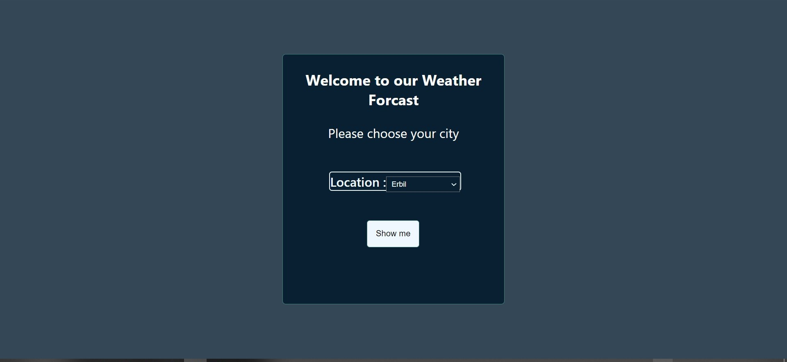

# Weather React

in this project is a simple  Dialy Weather Forecast is start with a simple card that requires a cite selection by default it select Erbil  and the other are Kirkuk and Sulaymaniyah after choosing the city then pressing the show me it will chnage the screen to the weather of the city with a simple design that show the weather .
some sample:

## programming language used are 
- Html 
- Css
- JavaScrip

## Framework or Library used
- React

## Tool that been Used 
- VsCode
- git & github

